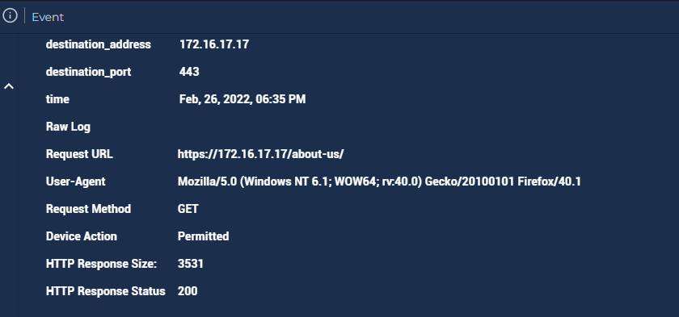
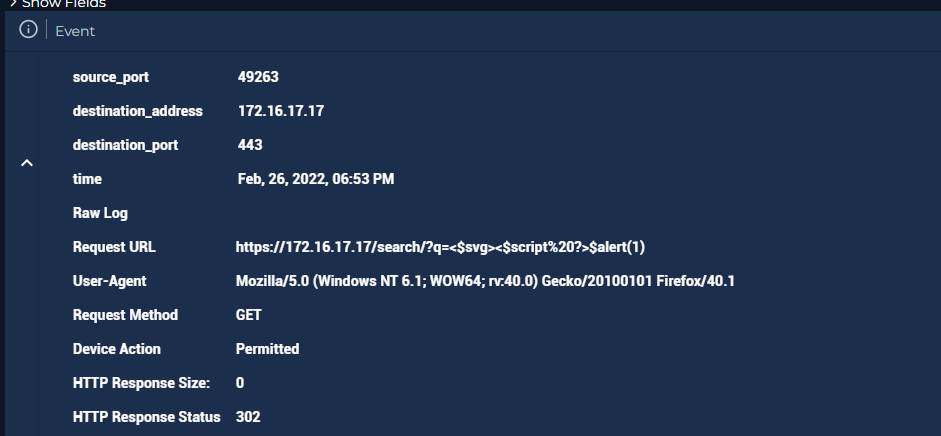
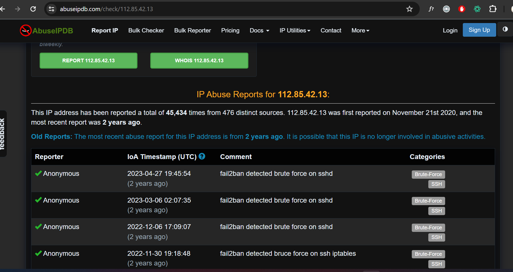

# SOC166 - Javascript Code Detected in Requested URL

## 1. Incident Overview

## 2. Investigation Steps
First things first, i want to make sure the attack status was successfull or not before move on further.

### 1) Log Analysis
   - The attacker starts with conducting a few normal url request before the real attacks attempt
     
     
     
   - Initial requested url: `https://172.16.17.17/` `https://172.16.17.17/about-us/` `https://172.16.17.17/search/?q=test`
   - These trusted requests resulting server to response with 200 meanings the request succeed.
   - Then they make a request containing obvious XSS payloads: `https://172.16.17.17/search/?q=prompt(8)` `https://172.16.17.17/search/?q=<$svg><$script%20?>$alert(1)`

      
     
   - The server response with 302 status code, redirect the attacker to the others page.

### 2) IP reputation

   
      The IP address of attacker `112.85.42.13` have been recorded in AbuseIPDB as malicious IP with 45,434 recorded cases.
      This record proves that this attack was not one of planned testing

## 3. Conclusion
      Since the payload is in the URL, it has been determined that it is a Reflected type XSS attack. Escalation to the next level is not required as the attack is not     
      successful. 
